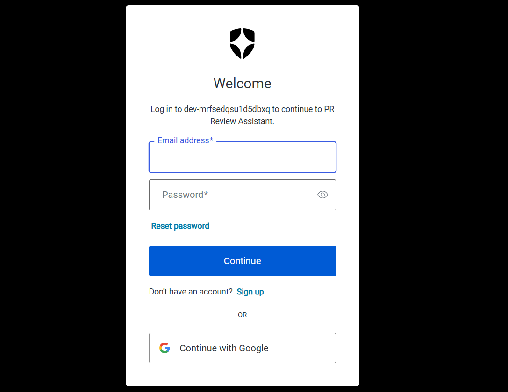
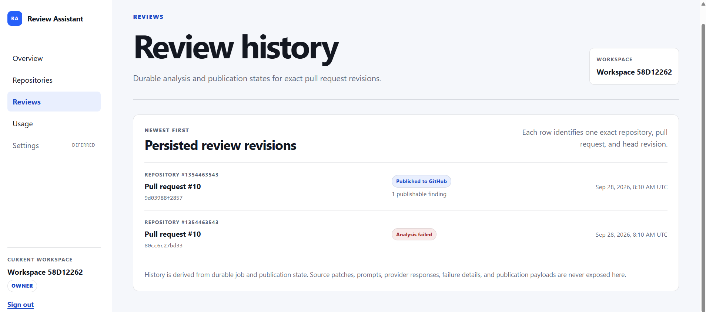
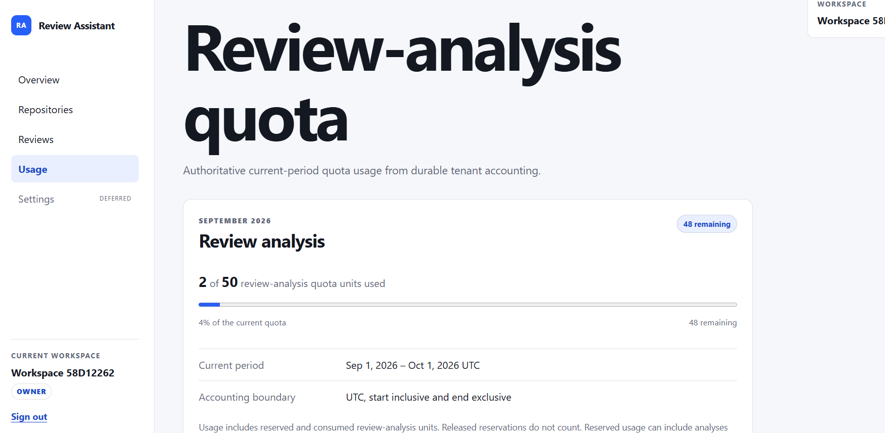
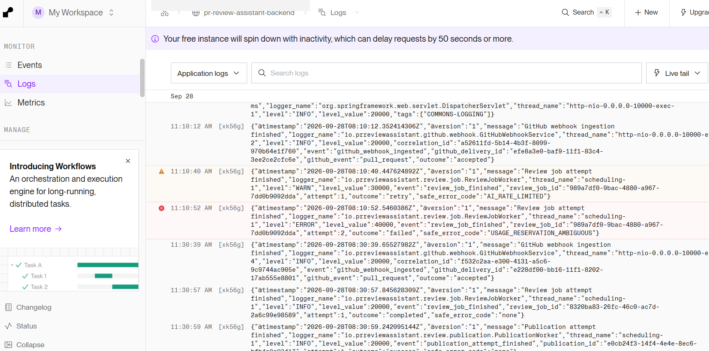
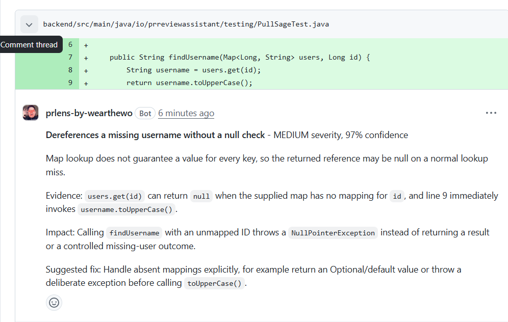

# PullSage

> An AI reviewer that comments less, but catches things that matter.

PullSage is an AI-assisted pull-request review platform designed around deterministic system boundaries surrounding probabilistic AI analysis.

## Architecture

### High-level flow

```text
GitHub Pull Request
        │
        ▼
GitHub App Webhook
        │
        ▼
Spring Boot API
  ├── Signature validation
  ├── Delivery deduplication
  ├── Installation/repository resolution
  └── Review job creation
        │
        ▼
PostgreSQL
        │
        ▼
Review Worker
  ├── Acquire review job
  ├── Retrieve bounded PR context
  ├── Reserve usage
  ├── Execute AI analysis
  ├── Validate findings
  └── Persist results
        │
        ▼
Publication Worker
        │
        ▼
GitHub Review API
        │
        ▼
Inline PR Findings
```

## System components

### Frontend

The dashboard is implemented with Next.js, React, and TypeScript. It provides authenticated access to PullSage workspaces and repositories while keeping backend and provider credentials outside the browser.

Authentication is handled through Auth0. Access tokens used to communicate with the Spring backend remain server-side.



The authenticated dashboard exposes durable review history and tenant-scoped usage without sending backend credentials to the browser.





### Backend

The core API and review pipeline are implemented with Java and Spring Boot. The backend is responsible for:

- OAuth2/JWT authorization
- GitHub webhook verification
- GitHub App installation management
- Workspace and membership authorization
- Repository and pull-request state
- Review job orchestration
- AI provider integration
- Usage accounting
- Review publication

### GitHub integration

PullSage operates as a GitHub App.

Signed pull-request webhook events are validated before processing. GitHub delivery IDs and persistent state make event processing safe against duplicate deliveries.

Personal GitHub App installations can be securely associated with an authenticated PullSage workspace without relying on repository names or client-supplied installation identifiers.

## Review pipeline

AI analysis is executed asynchronously rather than inside the webhook request. Webhook ingestion and review execution are therefore separated:

1. Receive and authenticate the GitHub event.
2. Persist the relevant pull-request and repository state.
3. Create a review job.
4. Process the job asynchronously.
5. Retrieve bounded repository context.
6. Execute AI analysis.
7. Validate and persist findings.
8. Create a publication job.
9. Publish findings through the GitHub API.

This keeps GitHub webhook handling fast and isolates external AI latency and failures from event ingestion.

## Reliability

The processing pipeline includes:

- Idempotent webhook handling
- Persistent job state
- Bounded retries
- Failure classification
- Usage reservation
- Duplicate-delivery protection
- Controlled publication
- Safe structured diagnostics

Review execution and GitHub publication are separate stages, so a successful AI analysis does not need to be repeated simply because publication temporarily fails.

## Security

The application uses:

- GitHub webhook signature verification
- OAuth2/JWT resource-server authentication
- Auth0 server-side sessions
- HttpOnly session cookies
- Server-side access tokens
- Content Security Policy
- Bounded external responses
- Fail-closed authorization
- Secret-safe structured logging
- Installation and account identity validation

Provider tokens, GitHub installation tokens, and backend access tokens are not exposed to browser JavaScript.

## Deployment

PullSage is containerized and deployed as separate frontend and backend services.

### Production topology

```text
GitHub
   │
   ├── pullsage.com
   │      └── Next.js frontend
   │
   └── api.pullsage.com
          └── Spring Boot backend
                 │
                 ├── PostgreSQL
                 ├── GitHub API
                 └── OpenAI API
```

The application currently runs on Render with:

- Dockerized services
- Custom frontend and API domains
- Managed HTTPS/TLS
- Environment-based secret configuration
- PostgreSQL persistence
- Health and readiness endpoints

Production diagnostics use bounded structured events rather than source code, prompts, credentials, or provider responses.



## CI/CD

GitHub Actions validates changes before merge. The pipeline includes:

- Backend tests
- Frontend tests
- Docker validation
- End-to-end tests
- Type checking
- Linting
- Production builds
- Database migration verification

Backend integration tests use PostgreSQL through Testcontainers to exercise the application against a real database engine.

## Production validation

The complete production workflow has been validated end to end:

```text
GitHub PR
  → signed webhook
  → webhook ingestion
  → persistent review job
  → AI analysis
  → persisted finding
  → publication job
  → GitHub API
  → inline pull-request review
```



PullSage successfully identifies findings against changed code and publishes the result directly on the relevant GitHub diff.
